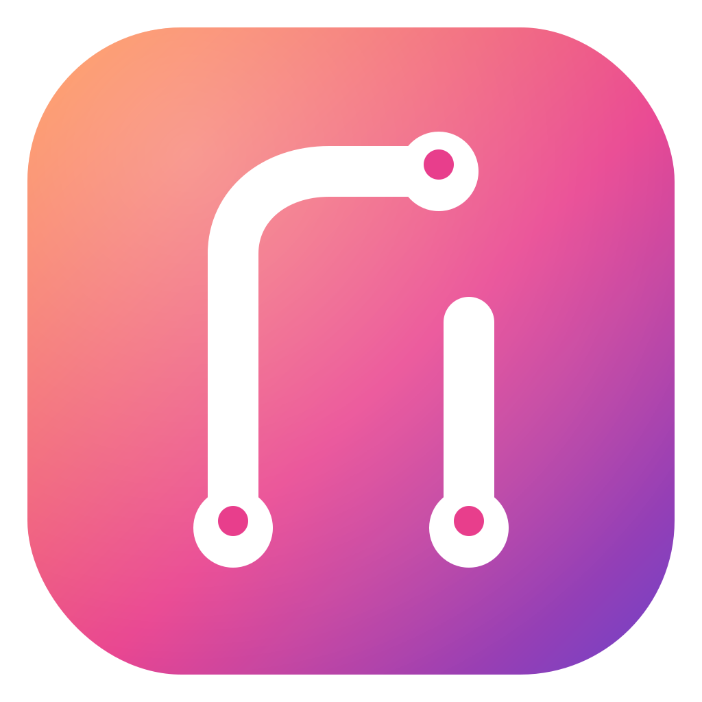

# README app-icon options (preview)

Four ways the app icon could land at the top of `README.md`. Each section below renders the actual pattern (so you can see what GitHub will draw) and shows the source you'd paste in. The image source in every option is `Resources/AppIcon-1024.png` — the existing 1024×1024 PNG that ships with the icon assets.

This file is for review only. **Do not merge** — once you pick a pattern, the chosen snippet replaces the current `# Agendum\n\nA native macOS viewer …` opening of `README.md` and this file goes away.

---

## Option A — Stacked block (Maccy / Pika style)

> Restrained, markdown-native, no centered divs. 128px is the de-facto "tasteful" size in this lane.



# Agendum

A native macOS viewer for your GitHub work: pull requests you authored, reviews requested of you, issues, and a small set of manual tasks. One window, one inbox, kept fresh by a background syncer.

### Source

```markdown


# Agendum

A native macOS viewer for your GitHub work: pull requests you authored, reviews requested of you, issues, and a small set of manual tasks. One window, one inbox, kept fresh by a background syncer.
```

---

## Option B — Centered hero (Ice / IINA / Plash style)

> The classic indie-mac-app look. Icon becomes the brand. 180×180 with a centered `<h1>` and tagline.

<div align="center">
  
  <h1>Agendum</h1>
  <p><b>A native macOS viewer for your GitHub work.</b></p>
</div>

Pull requests you authored, reviews requested of you, issues, and a small set of manual tasks. One window, one inbox, kept fresh by a background syncer.

### Source

```markdown
<div align="center">
  
  <h1>Agendum</h1>
  <p><b>A native macOS viewer for your GitHub work.</b></p>
</div>

Pull requests you authored, reviews requested of you, issues, and a small set of manual tasks. One window, one inbox, kept fresh by a background syncer.
```

---

## Option C — Centered hero with linked icon (Plash / Stats style)

> Same as B, but the icon is a clickable link to the Releases page. The icon doubles as a "go grab the DMG" CTA.

<div align="center">
  <a href="https://github.com/danseely/agendum-mac/releases">
    
  </a>
  <h1>Agendum</h1>
  <p><b>A native macOS viewer for your GitHub work.</b></p>
</div>

Pull requests you authored, reviews requested of you, issues, and a small set of manual tasks. One window, one inbox, kept fresh by a background syncer.

### Source

```markdown
<div align="center">
  <a href="https://github.com/danseely/agendum-mac/releases">
    
  </a>
  <h1>Agendum</h1>
  <p><b>A native macOS viewer for your GitHub work.</b></p>
</div>

Pull requests you authored, reviews requested of you, issues, and a small set of manual tasks. One window, one inbox, kept fresh by a background syncer.
```

---

## Option D — Inline-left float (MonitorControl style)

> Compact — icon, title, and tagline share the first screen. Float can look cramped on narrow viewports; `<br clear="left">` keeps the next section from wrapping.


# Agendum

A native macOS viewer for your GitHub work: pull requests you authored, reviews requested of you, issues, and a small set of manual tasks. One window, one inbox, kept fresh by a background syncer.

<br clear="left">

### Source

```markdown


# Agendum

A native macOS viewer for your GitHub work: pull requests you authored, reviews requested of you, issues, and a small set of manual tasks. One window, one inbox, kept fresh by a background syncer.

<br clear="left">
```

---

## Recommendation

**Option A.** It keeps the existing plain/factual/no-marketing tone intact while adding just enough visual identity that a stranger landing on the page knows this is a real app and not a code dump. It's the only option that's pure portable markdown — renders the same in any viewer, doesn't fight the `# Agendum` h1, no float-clearing quirks. B/C are a deliberate brand statement that probably isn't right for a `0.1.0-dev` personal-use prototype yet; D's MonitorControl shape is the weakest of the four in practice.

## Optional tidiness

All four options point at `Resources/AppIcon-1024.png` directly. That's fine but slightly unusual — most repos park the README icon either in `.github/` (MonitorControl) or `assets/` (Plash uses `Stuff/AppIcon-readme.png`). If you want a sibling that's specifically the README's copy so future icon churn doesn't churn the README image, the cleanest move is copy `Resources/AppIcon-1024.png` → `.github/icon.png` and update the snippet `src` accordingly. Not required.
